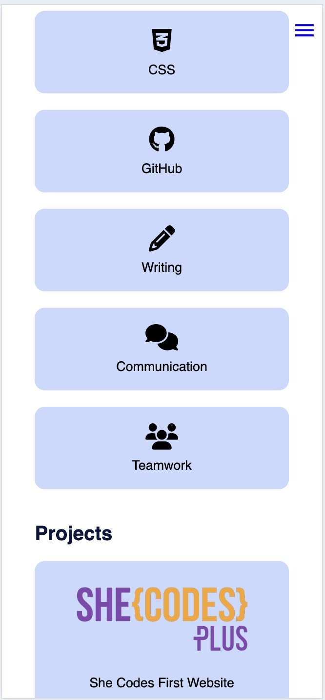

#  Jessica Keating - Portfolio Task
​
[My portfolio site](https://jess-k92.github.io/index.html)
​
## About

Personal Portfolio - created as part of She Codes Australia Plus Program, 2025.

## Project Requirements

### Content
- [X] At least one profile picture
- [X] Biography (at least 100 words).
- [X] Functional Contact Form
- [X] "Projects" section
- [X] Links to external sites, e.g. GitHub and LinkedIn.

There is a profile picutre of myself placed on the header of the site. This remains there on the second page as well. There is a 100 word bio on the home page that gives a general description of who I am and things that I like to do. I further added to this on the second page titled, About Me, where I have incldued more detail about myself and my experience. The contact form at the bottom of the home page is functional. To make the form work I have used Formspree. There is a projects section where I have linked my GitHub repository for the She Codes First Website that we build as an example during out HTML and CSS course. I do not currrently have other projects to link here but have included teo placeholders in the meantime and will endevour to link further projects as I complete them in the She Codes Plus course. You will find working URL links to my GitHub and LinkedIn in the footer of the site.
​
### Technical
- [X] At least 2 web pages.
- [X] Version controlled with Git
- [X] Deployed on GitHub pages.
- [X] Implements responsive design principles.
- [X] Uses semantic HTML.

I have added an About Me page where I have included further information about myself, my experience and skills. This page also has a functioning menu that will take you back to the home page and/or to the other sections on the home page depending on your menu selection. My GitHub repositiry can be found here (https://github.com/Jess-K92/Jess-K92.github.io). Where I have followed best practice to version track my updates and the deployment. Where I have followed best practice to version track my updates and the deployment. Media queries have been included to ensure that the content can be viewed in a easy to read manner that is appealing.

### Bonus (optional)
- [X] Different styles for active, hover and focus states.
- [ ] Include JavaScript to add some dynamic elements to your site. (Extra tricky!)

I included hover state on the Skills and Project cards on the Home page and also on the About Me page to highlight the information. I also added in a functional hamburger menu. 
​
### Screenshots

####  Wireframe images 

####  Desktop Screenshots Hompage

####  Desktop Screenshots About Me

#### Desktop Hover Screenshots

####  Mobile Homepage Screenshots

####  Mobile About Me Screenshots

####  Mobile Hamburger Menu Screenshots

